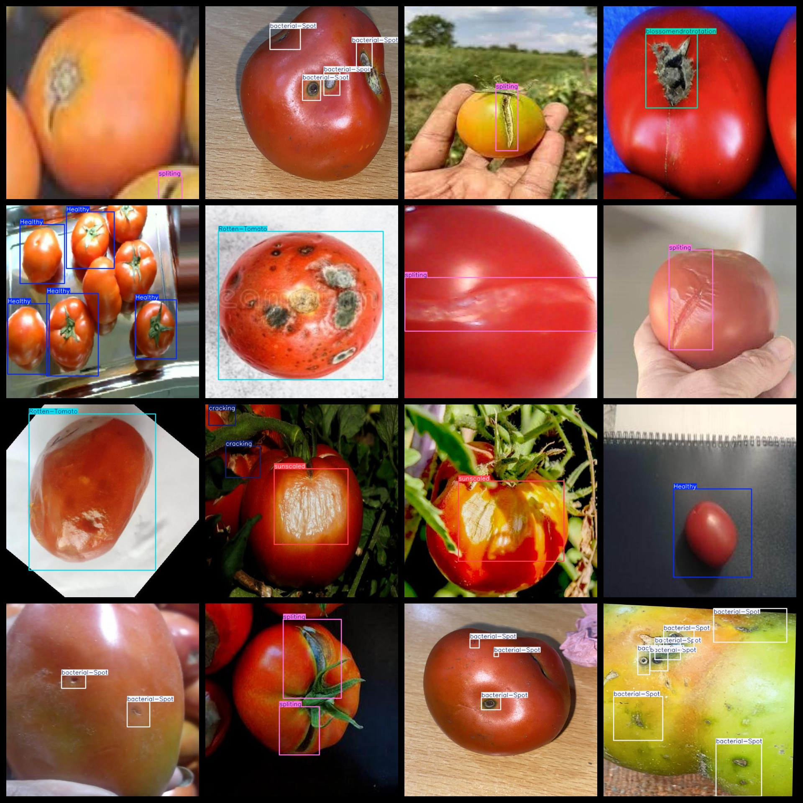
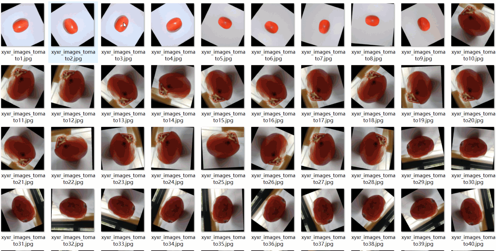

# [Object Detection] Tomato Fruit Disease Detection Dataset

7-classLabels: YOLO+VOC ((Augmented) )

Dataset format: VOC format + YOLO format

Compressed package includes: 3 folders, storing images, xml, and txt files

JPEGImages folder contains a total of 6998 JPEG images

Annotations folder contains a total of 6998 xml files

labels folder contains a total of 6998 txt files

Number of labels: 7

Label names: ["Healthy", "Rotten-Tomato", "bacterial-Spot", "blossomendrotrotation", "cracking", "spliting", "sunscaled"]

Box numbers for each label (Note: the order of categories in YOLO format does not correspond to this, but is based on the classes.txt in the labels folder):

Healthy box number = 4253 (Healthy)

Rotten-Tomato box number = 985 (Rotten-Tomato)

bacterial-Spot box number = 4190 (Bacterial-Spot)

blossomendrotrotation box number = 1344 (Blossom-Endrot)

cracking box number = 2163 (Cracking)

spliting box number = 1930 (Splitting)

sunscaled box number = 1334 (Sun-Scaled)

Total box numbers: 16199

Image resolution: Clear

Image enhancement: Yes

Label shape: Rectangular boxes, used for target detection recognition

Important Notice: No guarantees are made regarding the accuracy or reliability of the trained models or weight files provided by this dataset; only accurate and reasonable annotations are provided.

Annotation example:

**General overview of the images**

## Images

---

Here is a pay link on Stripe (https://buy.stripe.com/3cs8yP7sY87d0vu9AB). Please contact me lonlonago@foxmail.com after funding $89, and I will send you a complete data files, thank you!

